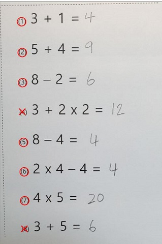
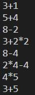
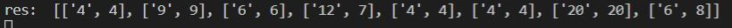

# ########수정 중입니다########

[이미지 변환전]

[Gray변환, 반전, 가우시안 블러적용]

[수식 이미지]

[수식 인식]

[확률]

[예측된 수식과 결과]

[인식]

[정답 표시]

[필기체로 인식 후 정답 표시]

[필기체 수식 인식]

[필기체 계산 값 예측 및 수식 결과 값 예측]

[요약도 - Train]

1) 이미지 수집

2) 이미지 분류

3) 이미지 학습

[요약도 - Test]

1) 이미지 불러오기

2) Gray 처리

3) 가우시안 블러 처리

4) Threshold 값 처리

5) Contour 찾기

6) 찾은 contour들을 문제 번호 순서대로 정렬

7) 각각의 contour를 자른다.

8) 자른 이미지 빈 공간 채워주기

9) 이미지 resize

10) 가우시안 블러 처리

11) 이미지 반전

12) "float32" 타입 배열로 변환

13) 정규화(배경 조정)

14) 학습된 데이터와 비교하여 예측

15) 예측된 수식 계산

16) 예측된 결과와 수식 결과 비교

17) 맞은 문제 O, 틀린 문제 X 표시

18) 점수 표시