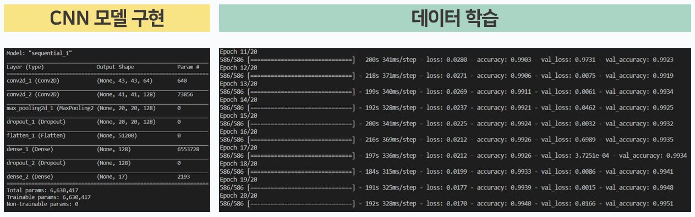
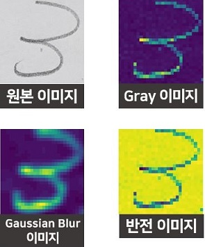
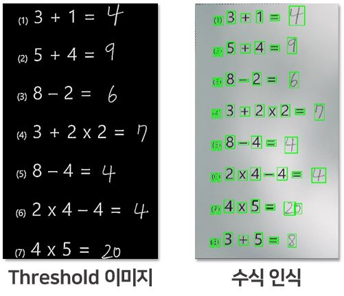
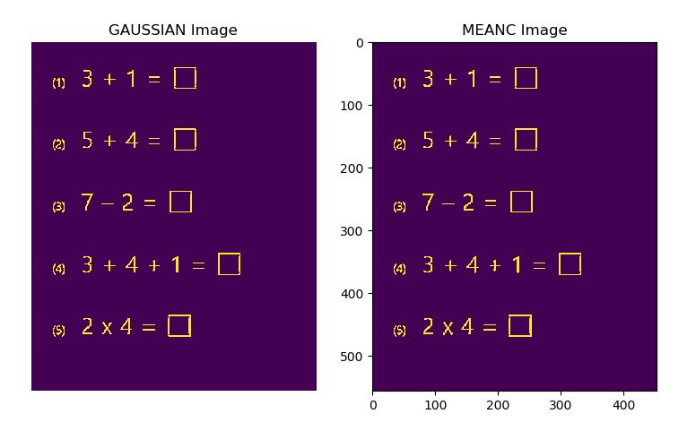
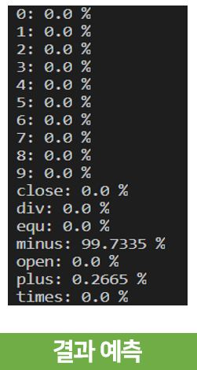
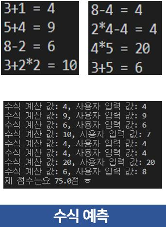
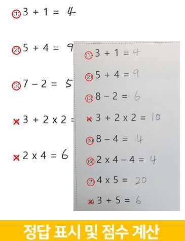

# Machine Learning

<br>

## TRAIN



```python
model = Sequential()

# 필터개수, 필터 사이즈, activation function , input_shape=(가로크기,세로크기,차원)
model.add(Conv2D(64, (3, 3), activation='relu', input_shape=(45, 45, 1)))
model.add(Conv2D(128, (3, 3), activation='relu'))
model.add(MaxPooling2D(pool_size=(2, 2)))
model.add(Dropout(0.25))
# model.add(BatchNormalization()) # 정규화
model.add(Flatten())
model.add(Dense(128, activation='relu'))
model.add(Dropout(0.5))
model.add(Dense(nb_classes, activation='softmax'))

model.compile(loss='categorical_crossentropy',# mean square error, mean absolute error 등 사용 가능
              optimizer='adam',	# 최적화 알고리즘, sgd, adam 등등
              metrics=['accuracy'])
```

<br>

<br>

## TEST


### 이미지 변환

<div class="image" style="margin:auto;">




</div>

```python
img = cv2.imread(image_path) # 이미지를 불러온다.
img_gray = cv2.cvtColor(img, cv2.COLOR_BGR2GRAY) # Gray Image 
# RGB를 Gray로 변환(3차원 -> 1차원)
img_inv = cv2.bitwise_not(img_gray)	# Inverse Image
img_blur = cv2.GaussianBlur(img_inv, (5, 5), 0)  # Gaussian Image (5,5) 필터로 적용
```

<br>

<div class='image'>



</div>

```python
img_th = cv2.adaptiveThreshold(img_blur, 255, cv2.ADAPTIVE_THRESH_GAUSSIAN_C, cv2.THRESH_BINARY_INV, 5, 2)
# adativeThreshold로 이미지 보정
# (img, Threshold 값 이상이면 바꿀 값, Method, Type, 필터 사이즈, 평균이나 가중평균에서 차감할 값)
```

<br>

##### [GAUSSIAN_C VS MEAN_C]

<div class ='image'>



</div>

```python
img_th = cv2.adaptiveThreshold(img_blur, 255, cv2.ADAPTIVE_THRESH_GAUSSIAN_C, cv2.THRESH_BINARY_INV, 3, 2)
# adativeThreshold로 이미지 보정
# (img, Threshold 값 이상이면 바꿀 값, Method, Type, 필터 사이즈, 평균이나 가중평균에서 차감할 값)

img_th = cv2.adaptiveThreshold(img_blur, 255, cv2.ADAPTIVE_THRESH_MEAN_C, cv2.THRESH_BINARY_INV, 3, 2)
```

<br>

<br>

### 결과

##### [contour 하나의 확률]

<div class='image'>



</div>

```python
print('predict: "{}" {}%'.format(predict_num, maxPredict)) # 예측 숫자, 가장 높은 확률의 숫자
print('predict: ', classes[np.argmax(output)]) 	# 분류한 classes key 값
for i in range(len(classes)):
    print('{}: {} %'.format(classes[i], round(output[0][i]*100,4))) # classes 각각의 확률
```

<br>

<div class='image'>



</div>


<br>

<div class='image'>



</div>

<br>

<br>

## 요약도

<div class='image'>

| 순서 |          Train          |                   Test                   |
| :--: | :---------------------: | :--------------------------------------: |
|  1   | 이미지 수집 (약 15만개) |             이미지 불러오기              |
|  2   |       이미지 분류       |                Gray 처리                 |
|  3   |      CNN 모델 구현      |            가우시안 블러 처리            |
|  4   |       이미지 학습       |            Threshold 값 처리             |
|  5   |                         |               Contour 찾기               |
|  6   |                         | 찾은 contour들을 문제 번호 순서대로 정렬 |
|  7   |                         |         각각의 contour를 자른다.         |
|  8   |                         |       자른 이미지 빈 공간 채워주기       |
|  9   |                         |              이미지 resize               |
|  10  |                         |            가우시안 블러 처리            |
|  11  |                         |               이미지 반전                |
|  12  |                         |        "float32" 타입 배열로 변환        |
|  13  |                         |            정규화(배경 조정)             |
|  14  |                         |      학습된 데이터와 비교하여 예측       |
|  15  |                         |             예측된 수식 계산             |
|  16  |                         |       예측된 결과와 수식 결과 비교       |
|  17  |                         |      맞은 문제 O, 틀린 문제 X 표시       |
|  18  |                         |                점수 표시                 |

</div>


