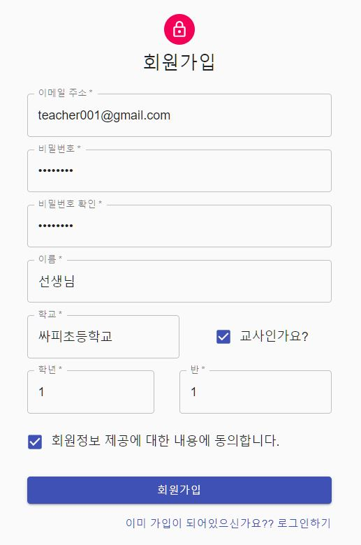
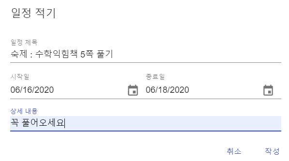
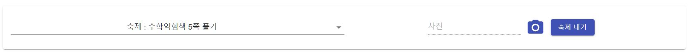
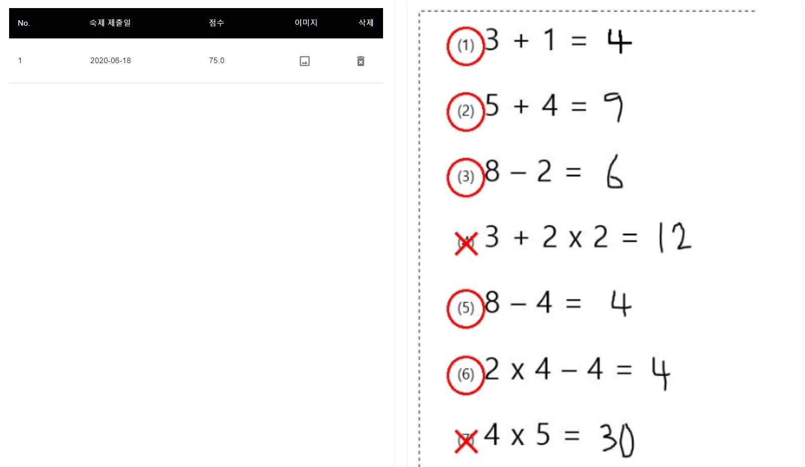

<h1 align="center">
  머신러닝을 이용한 지능형 온라인 과제 관리 시스템 𝙃𝙤𝙢𝙚𝙇𝙚𝙖𝙧𝙣
  <br />
  ₂₀.₀₅.₀₄ ₋ ₂₀₂₀.₀₆.₀₉
</h1>

<div align="center">
  
  [](#contributors-)
  

</div>

## Contributors ✨
Thanks goes to these wonderful people

<!-- ALL-CONTRIBUTORS-LIST:START - Do not remove or modify this section -->
<!-- prettier-ignore-start -->
<!-- markdownlint-disable -->
<table>
  <tr>
    <td align="center">
      <a href="https://github.com/sarbikbetal"></a><br />
      <a href="https://github.com/HelomeProject/HelpHomework/commits?author=GoPro1147" title="Code">
        <sub><b>KoTaeHwan</b></sub><br />💻
      </a>
    </td>
    <td align="center">
      <a href="https://github.com/NamSeonWoong"></a><br />
        <a href="https://github.com/HelomeProject/HelpHomework/commits?author=GoPro1147" title="Code">
          <sub><b>NamSeonWoong</b></sub><br />💻
      </a>
    </td>
   <td align="center">
      <a href="https://github.com/kHeNoTbB"></a><br />
     <a href="https://github.com/HelomeProject/HelpHomework/commits?author=kHeNoTbB" title="Code">
        <sub><b>Hailey</b></sub><br />💻</a>
    </td>
   <td align="center">
      <a href="https://github.com/cdh3261"></a><br />
      <a href="https://github.com/HelomeProject/HelpHomework/commits?author=cdh3261" title="Code">
        <sub><b>cdh3261</b></sub><br />💻
     </a>
    </td>
  </tr>
</table>
<!-- markdownlint-enable -->
<!-- prettier-ignore-end -->
<!-- ALL-CONTRIBUTORS-LIST:END -->

<!--
| 이름       | 역할  | 담당 업무                                                    |
| ---------- | ----- | ------------------------------------------------------------ |
| 고태환(PM) | FE/BE | React.js FE 개발 및 배포, Django BE 개발 및 배포, 프로젝트 관리 및 운영 |
| 남선웅     | FE    | React.js FE 개발, UI 구현 (Material UI), UCC 제작 및 시연    |
| 김하은     | BE    | Springboot-MyBatis BE 개발 및 배포, DB 설계 및 구축 (MySQL), AWS Maintainer, Git Maintainer |
| 최동호     | ML    | 머신러닝 알고리즘 (Tensorflow Keras), 수식 이미지 인식(OpenCV), 숫자/기호 데이터 수집 및 변환, 수식 예측 알고리즘 |
-->


## 주요기능

* 보다 쉬운 학사 관리를 위한 공지사항 및 과제 관리 Scheduler
* 과제 업로드 시, 해당 과제에 대한 정답/오답 여부 및 점수 실시간 확인 가능


## Getting Start

## 이 프로젝트를 실행하고 싶을 때 ( Localhost 기준 )

##### &#128680; 본 프로젝트는 git clone 시 Root Directory에서 작업한다는 기준으로 작성했습니다.


## 1. Deep Learning 모델 만들기

 	### 1. Dataset 만들기

​	[데이터셋 만드는 방법](./makedataset.md)


 ### 2. train.py 실행

실행하기 전에 ML 폴더에서 터미널에서 다음 명령어를 타이핑해필요한 파이썬 패키지를 설치해준다.

```
pip install -r requirements.txt
```


### 3. model.hdf5, classes.pkl 파일 생성

훈련이 끝나면 model.hdf5, classes.pkl 파일이 생성되는데 이 파일을 MLSERVER 폴더에 복사해준다.


##### &#9995; 1번 Deep Learning 모델 만들기를 생략하고 싶을 때

https://drive.google.com/file/d/1tQzC7I_xDwOXlpHZiSGoNp8zx6Yon-cs/view?usp=sharing
링크에서 다운받으면 된다.


## 2.  FE
### 1. axios 요청 시 baseurl 변경
  `FRONTEND/hhfe/src/index.js` 내부의 `axios.defaults.baseURL`의 값을 `http://localhost:9090/api/`으로 바꾼다. ( spring도 로컬로 돌아간다는 가정하에 )

​    

### 2. 다음 파일들의 내부의 `frouturl` 변수 값을 `http://localhost:8000` 으로 바꾼다. (ML SERVER로 보냄)

    `FRONTEND/hhfe/src/components/mainpage/homework/FileUpload.js`
    
    `FRONTEND/hhfe/src/components/mainpage/homework/HomeworkContent.js`
    
    `FRONTEND/hhfe/src/components/mainpage/homework/ScoreTable.js`
    
    `FRONTEND/hhfe/src/components/mainpage/notification/NoticeInfoTable.js`


​    

### 3. MLSERVER에 보낼 경로 지정
`FRONTEND/hhfe/src/components/mainpage/homework/FileUpload.js`의 `onClick` 함수 내부의 axios.post 요청을 `http://localhost:8000/api/v1/calc/`로 바꾼다.

`FRONTEND/hhfe/src/components/mainpage/notification/NotiAddForm.js` 의 `onClick` 함수 내부의 **두 번째** axios.post 요청을 `http://localhost:8000/api/v1/addnoti/` 로 바꾼다.

   

### 4. 서버 실행

서버 실행 전에 필요한 package 설치를 위해 다음과 같은 명령어를 터미널에 친다. 

작업 폴더 위치 (FRONTEND/hhfe)


```
npm install 
```

설치가 왼료되면 다음과 같은 명령어를 터미널에 쳐 개발용 서버를 실행한다.

```
npm start
```


## 3. BE (Spring Boot)

### 1. 스프링 서버 빌드

##### &#10024; [스프링 서버 빌드하는 법](https://lts0606.tistory.com/237)

위의 링크를 참고하여 스프링 서버를 빌드한다.


### 2. 스프링 서버 실행

다음 명령어를 타이핑해 스프링을 실행한다.

```
java -jar BootWeb-~~~ .war
```


### 4. BE ( Django )

실행하기 전에 MLSERVER 폴더에서 터미널에서 다음 명령어를 타이핑해필요한 파이썬 패키지를 설치해준다.

```
pip install -r requirements.txt
```

그 후에 Django server를 실행시킨다.

```
python manage.py runserver
```


## 5. 핵심 기능 실행하기

### 1. 교사 아이디 생성 후 로그인하기



### 2.  숙제 내기

​	로그인하면 달력 페이지에서 시작일을 클릭하면 숙제를 낼 수 있는 팝업이 뜬다.



### 3. 학생 아이디 생성 및 로그인하기

첫번째의 선생님 아이디 만들 때 처럼 회원가입을 하는데 단 회원가입 시 교사인가요 부분을 체크 해제한다.


### 4. 학생 숙제 제출

왼쪽 상단에 제출 현황 탭을 누르면 선생님이 숙제를 낸 목록을 볼 수 있고 옆에 파일 첨부를 통해 숙제를 재출한다.




### 결과

#### 제출한 파일


#### 홈페이지 결과




<hr>
<p align="center">
𝗗𝗲𝘃𝗲𝗹𝗼𝗽𝗲𝗱 𝘄𝗶𝘁𝗵 ❤️ 𝗶𝗻 𝗦𝗦𝗔𝗙𝗬
</p>
